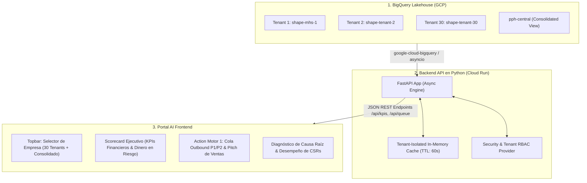

# 🏛️ AI Data Platform Portal — Estrategia de Arquitectura & Roadmap Multi-Tenant

**Documento Técnico y Estratégico de Ingeniería**  
**Proyecto:** Platform Partners • AI Data Platform  
**Entorno Nube:** Google Cloud Platform (GCP) • BigQuery Lakehouse  
**Versión:** 1.0.0 • Septiembre 2026  
**Autor:** Antigravity AI Data Platform Engineering  

---

## 1. Resumen Ejecutivo y Visión del Proyecto

### 1.1. Contexto y Propósito
El **Portal de Exploración de Datos e Inteligencia de IA (Portal AI)** es la interfaz central de toma de decisiones operativas y financieras de Platform Partners. Su propósito es consolidar el universo de llamadas de servicio al cliente (ServiceTitan Telecom API), enriquecerlas mediante modelos de IA Multimodal (Google Gemini 2.5 Flash en Vertex AI) y proporcionar una herramienta analítica y operativa de recuperación de ingresos en tiempo real.

### 1.2. El Reto y el Estándar de Excelencia
El objetivo del proyecto es superar con creces los prototipos tradicionales o reportes básicos de contabilidad/BI, construyendo una **verdadera plataforma de software empresarial de alto rendimiento** que cumpla con los siguientes principios rectores:
* **Profesional, Serio y Corporativo:** Estética oscura moderna, legible, de alta densidad informativa, sin elementos gráficos infantiles ni sobrecargas innecesarias.
* **Tiempo Real y 100% Conectado:** Conectado directamente a la fuente de la verdad en BigQuery (`shape-mhs-1` y futuros tenants), reflejando automáticamente el crecimiento continuo de datos sin parches estáticos.
* **Accionable (Action Motor 1):** No es un visor pasivo; entrega listas de priorización de ventas Outbound (P1/P2), pitches recomendados y coaching de CSRs con trazabilidad financiera determinista.
* **Control y Mantenibilidad Total:** Código modular, transparente y comprensible, sin "cajas negras" ni dependencias mágicas.
* **Escalabilidad Multi-Tenant Nativa:** Diseñado desde su origen para atender a **30+ empresas individuales** y una **Vista Consolidada (Holding / Portafolio)**.

---

## 2. Definición del Problema y Requisitos de Escala

### 2.1. Desacoplamiento de la Capa de Datos vs. Limitaciones de Archivos Estáticos
En fases tempranas de prototipado, el uso de archivos JSON/JS locales generó un cuello de botella arquitectónico: cuando los pipelines de ingesta en BigQuery procesan llamadas continuamente (escalando de 981 a 2,316 y 2,635+ llamadas), un frontend estático queda desfasado y ciego ante el estado real de la base de datos.

### 2.2. Requisitos de Escala (30 Tenants + Consolidación)
1. **Modo Empresa Individual (Tenant View):** Capacidad de seleccionar cualquiera de las 30 empresas del portafolio (ej. *Monarch Home Services*, *Tenant 02*, etc.) para visualizar sus métricas aisladas, agentes, causas raíz y cola de recuperación.
2. **Modo Portafolio Consolidado (Holding Roll-Up):** Vista ejecutiva global que agrega los indicadores de las 30 empresas en tiempo real ($35M+ en riesgo consolidado, benchmarks comparativos de conversión de CSRs, detección de patrones sistémicos).
3. **Caché Granular por Tenant:** Evitar la saturación de costos de escaneo en BigQuery almacenando en memoria el resultado de cada tenant de forma independiente con expiración inteligente (TTL).

---

## 3. Evaluación Tecnológica y Cuadros Comparativos

Se evaluaron las cuatro grandes familias arquitectónicas disponibles en la industria y en Google Cloud Platform:

```
                                    ESPECTRO DE SOLUCIONES
   ┌───────────────────────┬───────────────────────┬───────────────────────┬───────────────────────┐
   │       OPCIÓN 1        │       OPCIÓN 2        │       OPCIÓN 3        │       OPCIÓN 4        │
   │  GCP Native Managed   │   Python Data Apps    │  Enterprise Decoupled │   Fullstack TS/React  │
   │ (Looker / Embedded)   │ (Streamlit/Cloud Run) │  (FastAPI + Frontend) │ (Next.js / Cloud Run) │
   └───────────────────────┴───────────────────────┴───────────────────────┴───────────────────────┘
   Bajo Código / Rápido   │  100% Python / Ágil   │  Máximo Control y UX  │  Ecosistema Web Puro  │
```

---

### Cuadro 1: Rendimiento, Nube (GCP) e Infraestructura

| Criterio Técnico | Opción 1: Looker / BI Engine | Opción 2: Streamlit en Cloud Run | **Opción 3: FastAPI (Python) + Frontend** | Opción 4: Next.js (Node.js) |
| :--- | :--- | :--- | :--- | :--- |
| **Integración BigQuery** | 🟢 Nativa (Zero Code) | 🟢 Nativa (`google-cloud-bigquery`) | 🟢 **Nativa y Asíncrona (`asyncio`)** | 🟡 SDK Node.js |
| **Despliegue en GCP** | 🟢 SaaS Gestionado | 🟢 Cloud Run (Serverless) | 🟢 **Cloud Run (Escala a $0)** | 🟢 Cloud Run |
| **Latencia de Respuesta UI** | 🟡 1.5 - 3.0 segundos | 🟡 1.0 - 2.5 segundos (re-ejecución) | 🟢 **Ultrarrápida (<50ms en UI)** | 🟢 Muy rápida (<100ms) |
| **Gestión de Caché** | 🟢 BigQuery BI Engine | 🟢 `@st.cache_data` | 🟢 **In-Memory / Redis por Tenant** | 🟢 React Cache / ISR |
| **Costo de Operación Nube**| 🔴 Alto (Licenciamiento por usuario)| 🟢 Mínimo (1 contenedor Cloud Run) | 🟢 **Mínimo ($0 - $15/mes total)** | 🟢 Mínimo (1 contenedor) |

---

### Cuadro 2: Flexibilidad de Diseño, Funcionalidad y Mantenibilidad

| Criterio de Desarrollo | Opción 1: Looker / BI Engine | Opción 2: Streamlit en Cloud Run | **Opción 3: FastAPI + Frontend** | Opción 4: Next.js (Node.js) |
| :--- | :--- | :--- | :--- | :--- |
| **Control Pixel-Perfect UI** | 🔴 Nulo (Plantillas rígidas) | 🟡 Medio (Widgets prefabricados) | 🟢 **100% Control (HTML5/CSS3)** | 🟢 100% Control (Tailwind/CSS) |
| **Action Motor 1 Interactivo**| 🔴 No soportado (Solo lectura) | 🟡 Callbacks básicos | 🟢 **Extensible (Audio, CRM, Triggers)** | 🟢 Totalmente extensible |
| **Complejidad del Código** | 🟢 Mínima | 🟢 Baja (1 script Python) | 🟢 **Baja-Media (API limpia + UI modular)**| 🔴 Alta (Bundlers, Hooks, TS) |
| **Alineación con Data Pipelines**| 🔴 Desconectado de Vertex AI | 🟢 100% Python | 🟢 **100% Python (Mismo stack de BQ/AI)** | 🟡 Requiere doble stack (Py + TS) |

---

### Cuadro 3: Escalabilidad Multi-Tenant (30 Empresas + Consolidado)

| Criterio Multi-Tenant | Opción 1: Looker / BI Engine | Opción 2: Streamlit en Cloud Run | **Opción 3: FastAPI + Frontend** | Opción 4: Next.js (Node.js) |
| :--- | :--- | :--- | :--- | :--- |
| **Selector de Empresa (30 Tenants)**| 🟡 Filtro de tablero | 🟡 Re-renderiza todo el script | 🟢 **Cambio instantáneo en DOM (<30ms)**| 🟢 Cambio en React State |
| **Aislamiento de Caché por Tenant**| 🟡 Caché global compartida | 🔴 Riesgo de colisión en sesión | 🟢 **Claves aisladas (`tenant:id:kpis`)** | 🟢 Claves aisladas |
| **Agregación Consolidada Paralela**| 🟡 UNION SQL masivo | 🔴 Ejecución secuencial lenta | 🟢 **`asyncio.gather` (30 queries en paralelo)**| 🟢 `Promise.all` en paralelo |
| **Preparación para RBAC / Seguridad**| 🟡 Row Level Security complejo | 🔴 Difícil de segregar por login | 🟢 **Nativo (JWT / Google IAM OAuth2)** | 🟢 Nativo (NextAuth) |

---

## 4. Arquitectura Seleccionada: Enterprise Decoupled (FastAPI + Frontend)

La arquitectura ganadora y definitiva es el modelo **Enterprise Decoupled**: un **Backend API asíncrono en Python (FastAPI)** que expone servicios REST gobernados y sirve un **Frontend modular de alto rendimiento (HTML5/CSS3/JS)**.



---

## 5. Especificación de la Capa de Backend (`server.py`)

### 5.1. Endpoints de la API REST

1. **`GET /api/companies`**  
   Retorna el catálogo maestro de empresas registradas (IDs, nombres, estado y metadata de conexión).
2. **`GET /api/kpis?tenant={tenant_id}`**  
   Retorna el Scorecard Ejecutivo consolidado del tenant especificado o del portafolio global (`tenant=all`).
3. **`GET /api/root-causes?tenant={tenant_id}`**  
   Retorna la distribución de pérdida financiera categorizada por causa raíz (Precios, Disponibilidad, Competencia, etc.).
4. **`GET /api/csr-ranking?tenant={tenant_id}`**  
   Retorna la tabla de desempeño, conversión y dinero en riesgo atribuible a cada agente (incluyendo agentes virtuales como Broccoli AI).
5. **`GET /api/lost-queue?tenant={tenant_id}&priority={P1|P2|P3}`**  
   Alimenta el **Action Motor 1** con el listado de llamadas perdidas priorizadas, valor de la oportunidad, cliente y resumen generado por IA.

### 5.2. Estrategia de Caché e Invocación a BigQuery
* **TTL Configurable:** Cada consulta a BigQuery se almacena en memoria durante 60 segundos por defecto.
* **Invalidación por Evento:** Permite invocar `POST /api/sync?tenant={tenant_id}` para invalidar la caché inmediatamente cuando un pipeline de ingesta finaliza su ejecución.
* **Seguridad de Credenciales:** La autenticación se resuelve mediante **Application Default Credentials (ADC)** en desarrollo local y mediante la **Service Account nativa de Cloud Run** en producción, eliminando llaves API del código fuente.

---

## 6. Roadmap de Implementación

### Fase 1: Despliegue del Backend API Local & Conexión en Vivo (Inmediato)
* Implementar `server.py` utilizando FastAPI y `google-cloud-bigquery`.
* Conectar las consultas maestras gobernadas (`04_analytical_queries.sql`) a los endpoints del API.
* Conectar `index.html` y `llamadas.html` para consumir `http://localhost:8000/api/...` mediante llamadas `fetch()` nativas.
* Validar la actualización en vivo del contador de llamadas (2,635+) sin intervención de archivos estáticos.

### Fase 2: Motor Multi-Tenant & Vista Consolidada (30 Empresas)
* Implementar el enrutamiento dinámico de datasets en BigQuery (`shape-{company_id}`).
* Habilitar la agregación paralela asíncrona para la vista "🌐 Portafolio Consolidado (30 Empresas)".
* Integrar el selector de empresas en la barra superior de todas las páginas del portal.

### Fase 3: Despliegue Serverless en Google Cloud Run
* Empaquetar la solución en un `Dockerfile` optimizado y ligero (<150MB).
* Desplegar en **Google Cloud Run** en la región `us-central1` con auto-escalado (0 a 10 instancias).
* Configurar autenticación y dominio corporativo seguro.

---

## 7. Conclusión y Compromiso de Calidad

Esta arquitectura garantiza que Platform Partners cuente con una plataforma:
1. **Robusta y Escalable:** Capaz de crecer de 1 a 30+ empresas sin cambios de arquitectura.
2. **Económica y Eficiente:** Costo de infraestructura prácticamente nulo ($0 en reposo) y consultas optimizadas.
3. **100% Controlable:** Sin dependencias complejas de frameworks web pesados ni herramientas propietarias bloqueadas.
4. **Enfocada en Negocio:** Diseñada para recuperar dinero en riesgo y maximizar el ROI de cada llamada auditada por IA.

